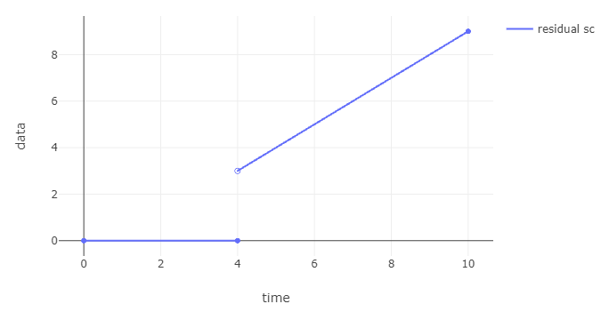

# Quick intro

The main types of the Nancy library are, of course, the representations of ultimately pseudo-periodic piecewise affine functions (henceforth, UPP) , meaning that `f(t + k*d) = f(t) + k*c` for any `t >= T` and natural `k` [\[1, chap. 4\]](#Dnc18).

> Within the library and documentation, the x-axis is referred as `time` and the y-axis as `value` or `data`

Nancy's main types are:

* `Point`, a single time-value pair, and `Segment`, defined in open interval `]a, b[`
* `Sequence`, which is piecewise affine function defined in a limited interval, constructed as a series of `Point`s and `Segment`s.
* `Curve`, which is the representation of a UPP function, constructed as a `Sequence` defined in `[0, T + d[` and the three parameters `T`, `d` and `c`

> These types are _immutable_, meaning that an object cannot be modified after initialization, rather a new copy must be initialized with different values. This is done for both safety of use and [parallelization](#sec_parallelization).

For example

```csharp
var c = new Curve(
    baseSequence: new Sequence(new Element[]
    {
        new Point(time: 0, value: 0),
        new Segment(startTime: 0, endTime: 2, rightLimitAtStartTime: 0, slope: 1),
        new Point(2, 2),
        new Segment(2, 3, 2, 0),
        new Point(3, 2),
        new Segment(3, 4, 2, 1)
    }),
    pseudoPeriodStart: 2    // T
    pseudoPeriodLength: 2,  // d
    pseudoPeriodHeight: 1   // c
);
```

Will result in the following:

<figure>
    
    <figcaption>Figure 1: Example of UPP curve. The points and segments in <code>[2, 4[</code> are repeated indefinitely.</figcaption>
</figure>

Simplified constructors are available for common types of curves.

```csharp
var sc = new RateLatencyServiceCurve(delay: 3, rate: 3);
var ac = new SigmaRhoArrivalCurve(sigma: 4, rho: 1);
```

<figure>
    
    <figcaption>Figure 2: Plot of RateLatency and SigmaRho curves.</figcaption>
</figure>

# Operators

The library implements the NC operators for all representable curves, which include

 * `Minimum` and `Maximum`
 * `Addition` and `Subtraction`, the latter with option to have the result non-negative (default) or not
 * `Convolution` and `Deconvolution`
 * `Vertical`- and `HorizontalDeviation`
 * `MaxPlusConvolution` and `MaxPlusDeconvolution`
 * `Lower`- and `UpperPseudoInverse`
 * `Sub`- and `SuperAdditiveClosure`
 * `Composition`

Manipulations:

 * `DelayBy` and `ForwardBy`
 * `VerticalShift`
 * `Cut` over finite interval

# Examples

The library can be used to compute delay and buffer bounds for any kind of curves.

```csharp
var sc = new RateLatencyServiceCurve(3, 3);
var ac = new SigmaRhoArrivalCurve(4, 1);
var delay = Curve.HorizontalDeviation(ac, sc);
// Output: 13/3
```

<figure>
    
    <figcaption>Figure 3: Plot of the arrival and service curves. The max horizontal deviation can be seen at <code>y = 4</code>.</figcaption>
</figure>

The calculation works also for general curves, for example (from [\[1, p. 121\]](#Dnc18)):

```csharp
var sc = Curve.Minimum(
    new RateLatencyServiceCurve(0, 3),
    new RateLatencyServiceCurve(4, 3) + 3
);
var ac = new SigmaRhoArrivalCurve(1, 1);
var delay = Curve.HorizontalDeviation(ac, sc);
// Output: 2/1
```

<figure>
    
    <figcaption>Figure 4: Plot of the arrival and service curves. The max horizontal deviation can be seen at <code>y = 3</code>.</figcaption>
</figure>

The operators can be used to naturally construct any min-plus expressions.
For example, computing a residual service curve in a FIFO server [\[1, p. 166\]](#Dnc18):

```csharp
var beta = new RateLatencyServiceCurve(2, 3);
var alpha = new SigmaRhoArrivalCurve(3, 2);
var theta = 4;
var delta_theta = new DelayServiceCurve(theta);

var alpha_theta = Curve.Convolution(alpha, delta_theta);
var diff = Curve.Subtraction(beta, alpha_theta, nonNegative: true);
var residual = Curve.Minimum(diff, delta_theta);
```

<figure>
    
    <figcaption>Figure 5: Plot of the FIFO residual service curve, computed with the code above.</figcaption>
</figure>

As another example, computing the strict service curve for Interleaved Weighted Round-Robin (IWRR) described in [\[2\]](#Iwrr21) (using Th. 1 with the parameters in Fig. 3):

```csharp
var weights = new []{4, 6, 7, 10};
var l_min = new []{4096, 3072, 4608, 3072};
var l_max = new []{8704, 5632, 6656, 8192};
var beta = new RateLatencyServiceCurve(
    delay: 0, 
    rate: 10000 // 10 Mb/s, but using ms as time unit
);
var unit_rate = new RateLatencyServiceCurve(0, 1);

// parameters computation omitted for brevity
int Phi_i_j(int i, int j, int x) { ... }
int Psi_i(int i, int x) { ... }
int L_tot(int i) { ... }

int i = 0; // the flow of interest
var stairs = new List<Curve>();
for(int k = 0; k < weights[i]; k++)
{
    var stair = new StairCurve(l_min[i], L_tot(i));
    var delayed_stair = stair.DelayBy(Psi_i(i, k * l_min[i])); 
    stairs.Add(delayed_stair);
}
var U_i = Curve.Addition(stairs); // summation of min-plus curves
var gamma_i = Curve.Convolution(unit_rate, U_i);
var beta_i = Curve.Composition(gamma_i, beta);
```

<figure>
    
    <figcaption>Figure 6: Plot of the IWRR strict service curve, computed with the code above.</figcaption>
</figure>

# Tuning performance

## Representation minimization

The `Curve` data structure is based on the UPP property which enables to represent a function `f(t)` for non-negative rationals `Q^+` by storing only a finite representation for `[0, T+d[`.
However, it is not guaranteed that such representation is the most efficient (i.e. the same `f(t)` cannot be represented with smaller `T` and/or `d`).
This is more so true for results of operators, since they are based on general proofs which are agnostic to the patterns and properties of operands and results, leading to a growth in the memory occupation and time complexity of subsequent operations.

To address this issue, Nancy implements an a posteriori optimization algorithm that will simplify the result of an operator to the minimal representation for the same `f(t)`. This algorithm is presented in detail in [\[3\]](#Ceff22).

## <a name="sec_parallelization"></a> Parallelization

Nancy uses C#'s [PLINQ](https://docs.microsoft.com/en-us/dotnet/standard/parallel-programming/introduction-to-plinq) feature which allows to easily parallelize independent computations over large sets, exploiting performance of multicore processors. 

## Settings

Most operators will have as a last optional argument a `ComputationSettings` object, that is used to tune how the operator is computed. 

The most relevant settings are `AutoOptimize`, which will apply representation minimization to all results (also intermediate ones) and `UseParallelism`, which will use parallelization when is (heuristically) deemed to be useful.
Both are set by default to `true`.

# Tutorials

The code for these examples, and others, can be found in the [examples](./examples/) folder, where you can edit the code and try it for yourself.

# References

In this intro we reference the following works.

 * <a name="Dnc18">[1]</a>
 Deterministic Network Calculus: From Theory to Practical Implementation, A. Bouillard and M. Boyer and E. Le Corronc, 2018
 * <a name="Iwrr21">[2]</a>
 Interleaved Weighted Round-Robin: A Network Calculus Analysis, S. M. Tabatabaee and J. Y. Le Boudec and M. Boyer, 2021
 * <a name="Ceff22">[3]</a>
 Computationally efficient worst-case analysis of flow-controlled networks with Network Calculus, R. Zippo and G. Stea, 2022, [arXiv](https://arxiv.org/abs/2203.02497)</a>
 