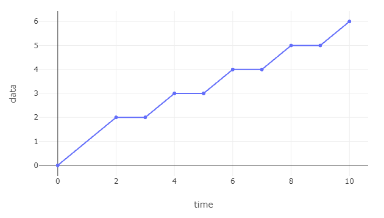

# Nancy
## _A computational library for Deterministic Network Calculus_

Nancy is a C# library implementing min-plus and max-plus operators for ultimately pseudo-periodic piecewise affine curves.

<figure>
    
</figure>

See the [webpage](https://rzippo.github.io/nancy/) for tutorials and the full documentation.
See the [tutorial notebooks](./examples/) to play directly with code.

Prebuilt package on [NuGet](https://www.nuget.org/packages/Unipi.Nancy/).

## Language and requirements

Nancy is a .NET 6.0 library, written in C# 10.
Both SDK and runtime for .NET are cross-platform, and can be downloaded from [here](https://dotnet.microsoft.com/en-us/download).

## References

The algorithms implemented here are discussed in the following works:

* An Algorithmic Toolbox for Network Calculus, Anne Bouillard and Éric Thierry, 2007
* Deterministic Network Calculus: From Theory to Practical Implementation, Anne Bouillard and Marc Boyer and Euriell Le Corronc, 2018
* Computationally efficient worst-case analysis of flow-controlled networks with Network Calculus, Raffaele Zippo and Giovanni Stea, 2022 [arXiv](https://arxiv.org/abs/2203.02497)
